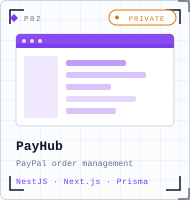

  

  &nbsp;&nbsp;
  &nbsp;&nbsp;
  

  

  

  
  
  
  

  <picture>
    <source media="(prefers-color-scheme: dark)" srcset="https://raw.githubusercontent.com/TranDinhVo/TranDinhVo/output/snake-dark.svg">
    
  </picture>

<b>About me</b>

 

- 🎓 Information Technology student at **University of Transport and Communications – Campus 2**
- 💻 I build full-stack web applications — mostly **Spring Boot / NestJS** on the backend and **React / Next.js** on the frontend
- 🏆 **Vietnam Student Mathematical Olympiad**: First Prize (2024) · Second Prize (2026) · Third Prize (2024, 2025)
- 🥉 **Third Prize** – Vietnam Student Informatics Olympiad (2024) · **ICPC Asia Regional** finalist (Hanoi 2024, Ho Chi Minh City 2025)
- 🔭 Currently working on financial & accounting systems (multi-currency, RBAC, audit logging)
- 📫 Open to **Full-stack / Backend internship** opportunities

<b>Featured projects</b>

 

| Project | Description | Stack |
|---|---|---|
| **[SPARK](https://github.com/TranDinhVo/SPARK)** | Personal expense management system — REST APIs, JWT auth, financial reports | Spring Boot · React · MySQL |
| **[Academix](https://github.com/XuanDiep0310/Academix)** | Academic management system — auth, protected routes, admin dashboard | ASP.NET Core · React · Redux |
| **[Learnex](https://github.com/TranDinhVo/Learnex)** | Mobile learning app | Flutter · Dart |
| **PayHub** *(private)* | PayPal transaction & order management — CSV import pipeline, RBAC, Decimal money handling | NestJS · Next.js · Prisma · PostgreSQL |
| **FinanceOS** *(private)* | Accounting platform — multi-currency, cash-flow state machine, audit log, 2FA | Next.js · Prisma · PostgreSQL · Ant Design |
| **TrendScope** *(private)* | Keyword & product trend tracker for SEO — scheduled ingestion pipeline, 30-day trend snapshots, Swagger API | NestJS · Next.js · Turborepo · PostgreSQL · Docker |
| **MonkeyMail** *(private)* | Desktop email client — multi-account IMAP/SMTP sync, conversation threading, offline SQLite cache | Tauri · React · Node.js · SQLite |

